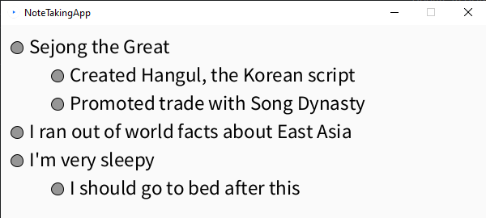
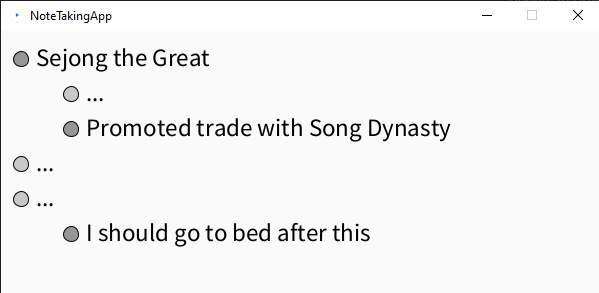

# B4AdvancedCompProg
B4 Advanced Computer Programming class portfolio

## Note Taking App
This app is a variation on a normal note taking app, and it has standard bullet points. Specifically, I added functionality that the user can toggle showing a line, to reduce clutter and make it easier to find specific things.
Each line of notes is an instantiation of the class Section. These have two functions, one for display and one for toggling. 

The toggle function works by testing if the user clicked on the button, and will change a boolean from true to false or vice versa.
The display function will take that into account when displaying, and show "..." when the boolean is false, but the actual line when it's true.

The code can be found in the projects/NoteTakingApp folder.

## Worsle (Wordle but worse)
This app is a demonstration of Input Output functionality, taking in a .txt file with a bunch of 4 letter words so that the user can play wordle with it. Basically, a scanner reads out the whole document and saves it to an arraylist, where a random number generator picks a random word.
This is my first solo project using the console with Java, and I'm quite proud of it for a one-day project. The code can be found in the projects/Mastermind/src folder.
